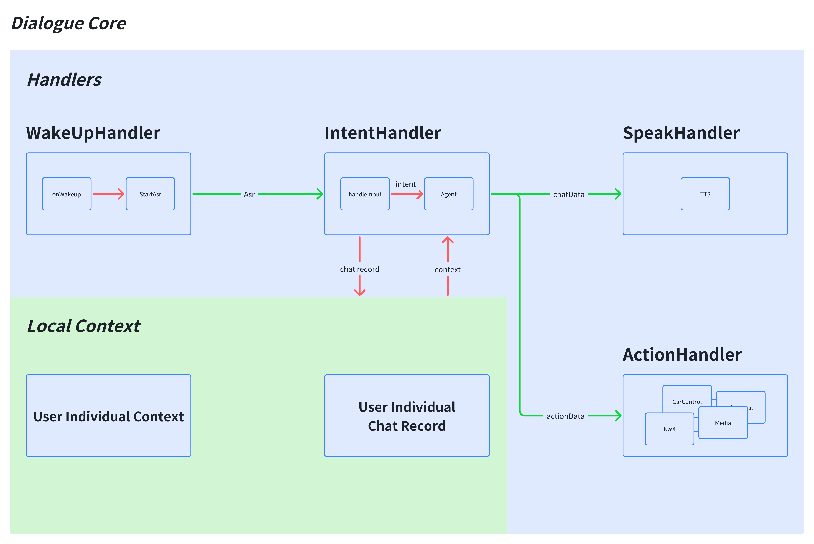

# Arch


# Desc
## WakeUpHandler
这是一个在 DialogueCore 中定义的函数，用于处理来自不同位置的唤醒事件（比如开启语音识别），可以通过position参数自定义识别的位置。

## IntentHandler
这是定义在DialogueCore的函数集合，存放用户注册的接收到不同Intent应该触发的动作。将用户的输入（asr结果或结构化数据）通过handleInput输入后请求nlu返回的意图识别的结果，决定是否更新用户的chatRecord，然后通过IntentHandlers中注册的处理器进行操作。

## SpeakHandler & ActionHandler
这是定义在DialogueCore的函数集合。IntentHandler处理后的数据需要播报和执行动作时，调用此处理器。需要在DSL中先注册好处理逻辑
# Feat
## 多意图并发
同一句话中含有多个意图，如"打开窗户顺便告诉我今天的天气"，意图解析出含有device-contro(开窗户)和weather(今天的天气)，且这两个操作支持并发操作，则可以同时播报天气和控制窗户。

## 多音区识别
多个音区positionType同时输入，可以根据individualPositionInput(独立位置输入)决定是否分别处理每个音区的请求。
举例说明，主副驾同时发起请求：
```kotlin
runBlocking {
    launch {
        val chat = ChatData(
        role = Role.User,
        content = "今天天气怎么样",
        userId = "1234",
        position = PositionType.Driver
        )
        DialogueManager.handleInput(chat)
    }

    launch {
        val chat = ChatData(
            role = Role.User,
            content = "讲个故事",
            userId = "12345",
            position = PositionType.Copilot
        )
        DialogueManager.handleInput(chat)
    }
    
    awaitCancellation()
}
```
如果未开启多音区独立输入，前一个请求会被后一个有效请求中断，响应如下:
```logcatfilter
handleInput: ChatData(conversationId=aeb7dfee75fc4dadafe55c4d23279cbd, role=User, content=今天天气怎么样, intent=, userId=1234, position=Driver, stream=false, finish=false, speakType=Tts, timestamp=1750316436670) individual: false
handleInput: ChatData(conversationId=d24b44059f964a62817569f2229e414e, role=User, content=讲个故事, intent=, userId=12345, position=Copilot, stream=false, finish=false, speakType=Tts, timestamp=1750316436695) individual: false

从前有个小镇，每到夜晚都会传来美妙的歌声。一天，一个小男孩决定寻找声音的来源，发现是一只受伤的小鸟在唱歌。他照顾小鸟直到它康复，从此小镇每晚都能听到更美的歌声。
```
如果开启多音区独立响应，则两个有效的请求互不影响：
```logcatfilter
handleInput: ChatData(conversationId=dbd3d27e4d4d4b3c8ef2a0e9dd9f1174, role=User, content=今天天气怎么样, intent=, userId=1234, position=Driver, stream=false, finish=false, speakType=Tts, timestamp=1750316608190) individual: true
startCollectingPosition: Driver
handleInput intent = IntentResponse(intents=[Intent(domain=weather, confidence=1.0, input=今天天气怎么样)], async=false)
handleInput: ChatData(conversationId=495fb82c637a433893cfe7c0e61cee2f, role=User, content=讲个故事, intent=, userId=12345, position=Copilot, stream=false, finish=false, speakType=Tts, timestamp=1750316608230) individual: true
startCollectingPosition: Copilot
handleInput intent = IntentResponse(intents=[Intent(domain=chat, confidence=1.0, input=讲个故事)], async=false)
从前有个小女孩，她每天都会在森林里遇到一只会说话的小狐狸。他们一起冒险，分享秘密，直到有一天，小狐狸消失了。女孩长大后，依然记得那段美好的时光。

action: ActionData(conversationId=dbd3d27e4d4d4b3c8ef2a0e9dd9f1174, action=weather_show_days, params=[{"date": "2025-06-19", "temperature": {"max": 30.1, "min": 21.0, "avg": 24.9}, "windspeed": 25.2, "conditions": "Rain, Partially cloudy", "humidity": 76.8}], timestamp=1750316608190)
今天是2025年6月19日，北京天气多云有雨，白天最高气温30℃左右，气温逐步升高，空气质量良好。紫外线较强，建议做好防晒。傍晚及夜间天气转为多云，湿度较大，体感较为舒适。
```
## 记录即时存档
通过使用Flow，能够将流式输出的TTS添加到记录中，即使当前TTS输出被中断，也能将已经输出的内容保存到记录中。需要注意的是，Record的记录按照User区分，不同User有不同的Record。
```logcatfilter
handleInput: ChatData(conversationId=0283261ee58d484e866fc761a85a0b02, role=User, content=今天天气怎么样, intent=, userId=1234, position=Driver, stream=false, finish=false, speakType=Tts, timestamp=1750316917385) individual: false
action: ActionData(conversationId=0283261ee58d484e866fc761a85a0b02, action=weather_show_days, params=[{"date": "2025-06-19", "temperature": {"max": 33.6, "min": 27.6, "avg": 30.1}, "windspeed": 18.7, "conditions": "Rain, Overcast", "humidity": 65.9}], timestamp=1750316917385)
今天是2025年6月19日，上海白天阴雨持续，最高气温33.6℃，体感闷热。空气质量一般，建议外出携带雨具。紫外线强度中等，仍需

handleInput: ChatData(conversationId=cc001767f9c84a45be86b49e29f2e16d, role=User, content=讲个故事, intent=, userId=12345, position=Copilot, stream=false, finish=false, speakType=Tts, timestamp=1750316926378) individual: false
🛑 [Driver] Previous input cancelled.
从前有个小镇，镇上有棵神奇的树，每到夜晚会发出柔和的光。一天，一个小女孩发现了这棵树，她每天都会来这里许愿。渐渐地，她的愿望都实现了，但她发现真正的幸福是分享这份神奇。

history: [ChatContent(role=User, content=今天天气怎么样, intent=, timestamp=1750316917385), ChatContent(role=Bot, content=今天是2025年6月19日，上海白天阴雨持续，最高气温33.6℃，体感闷热。空气质量一般，建议外出携带雨具。紫外线强度中等，仍需, intent=, timestamp=1750316917385)]
```
# Todo
## 记录同步
用户的对话记录可以同步到账户中，用于此用户的偏好更新。
## 上下文同步
车辆的环境状态，如果Agent处理请求较慢，可以通过一条独立的链接将状态同步到一个单独的ContextAgent中。